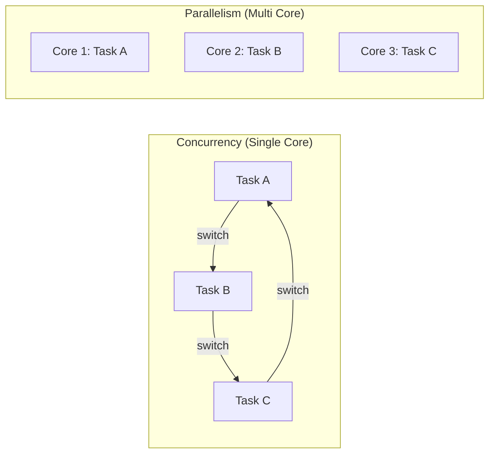
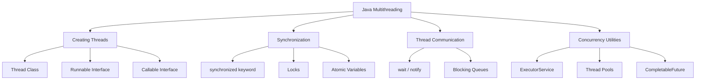

# Multithreading in Java — Complete Notes

---

## 1. Introduction to Multithreading

### 🤔 Before We Begin — What Problem Are We Solving?

Imagine you're at a **restaurant** — but there's only **one waiter** for the entire place. 

He takes an order from Table 1, walks to the kitchen, waits for the food to be ready, brings it back, and *only then* moves to Table 2. Meanwhile, Tables 3 through 10 are just sitting there — hungry and frustrated.

> Now imagine the restaurant hires **five waiters**. Suddenly, multiple tables are being served at the same time. Orders are taken in parallel, food arrives faster, and customers are happy.

**That's essentially what multithreading does for your Java programs.**

> Your program is the restaurant. The waiters are **threads**. And the customers? They're the **tasks** your program needs to get done.

---

### 📖 What is a Program, a Process, and a Thread?

Before jumping into multithreading, let's nail down three terms you'll hear constantly. Think of them as three levels of zoom:

#### Program

A program is a set of instructions written in a programming language, stored as a file on disk. It is a passive entity — it doesn't do anything until it is executed. For example, a .java file or a compiled .class file sitting on your hard drive is a program.

```
📁 MyApp.java  ←  This is a program (just a file, doing nothing)
```

#### Process

A process is a running instance of a program. When you **run** that program, the operating system loads it into memory and starts executing it. Now it becomes a **process**

Think of it like this: the recipe book is still on the shelf, but now a **chef has opened it and started cooking**. That active cooking session is a process.

> A process gets its own chunk of memory, its own resources, and is managed by the operating system.

#### Thread

A thread is the smallest unit of execution within a process that the CPU can schedule and run.

> If a process is a **kitchen**, then a thread is a **single chef** working in that kitchen. You can have one chef (single-threaded) or many chefs working together (multithreaded).

```
┌──────────────────────────────────────────────┐
│                  PROCESS                     │
│          (Your running Java app)             │
│                                              │
│   ┌──────────┐  ┌──────────┐  ┌──────────┐  │
│   │ Thread 1 │  │ Thread 2 │  │ Thread 3 │  │
│   │ (Chef 1) │  │ (Chef 2) │  │ (Chef 3) │  │
│   └──────────┘  └──────────┘  └──────────┘  │
│                                              │
│        Shared Memory (Shared Kitchen)        │
└──────────────────────────────────────────────┘
```

> **Key insight:** All threads within a process **share the same memory space** (like chefs sharing the same kitchen counter and ingredients). This is what makes threads lightweight and fast — but it's also what makes multithreading tricky (more on that later).

#### Quick Comparison

| Concept     | Real-Life Analogy           | Key Characteristic                                  |
|-------------|-----------------------------|------------------------------------------------------|
| **Program** | A recipe book on a shelf    | Static, just instructions, not running               |
| **Process** | A kitchen actively cooking  | Running instance, has its own memory & resources     |
| **Thread**  | A single chef in the kitchen| A flow of execution inside a process, shares memory  |

---

### 🧵 What Exactly is a Thread?

Let's zoom in a little more.

A **thread** is simply a **sequence of instructions** that can be executed independently. When your Java program starts, the JVM automatically creates one thread for you — the **main thread**. This is the thread that begins executing your `main()` method.

```java
public class HelloWorld {
    public static void main(String[] args) {
        // This code runs on the "main" thread
        System.out.println("Hello from the main thread!");
    }
}
```

Even this simple program uses a thread — you just never had to think about it before!

---

### 🚶 Single-Threaded Execution — One Thing at a Time

In a **single-threaded** program, tasks are done **one after another**, like a single queue at a billing counter. Task 2 can't start until Task 1 finishes. Task 3 waits for Task 2. And so on.

```
Single-Threaded Execution (Sequential):

Time ──────────────────────────────────────────►

 ┌────────────────┐┌────────────────┐┌────────────────┐
 │   Task A       ││   Task B       ││   Task C       │
 │  (Download     ││  (Process      ││  (Save to      │
 │   a file)      ││   data)        ││   database)    │
 └────────────────┘└────────────────┘└────────────────┘

 ◄──── 5 sec ────►◄──── 3 sec ────►◄──── 2 sec ────►

                Total time: 10 seconds
```

Everything happens in a straight line. Simple? Yes. Efficient? **Not always.**

#### The Problems with Single-Threaded Execution

1. **Wasted time during waiting:** If Task A is downloading a file from the internet, the CPU is mostly just *waiting* for the network. It could be doing something useful instead.

2. **Frozen user interfaces:** Ever clicked a button in an app and it froze? That's because the single thread was busy doing something else (like loading data) and couldn't respond to your click.

3. **No use of modern hardware:** Your computer likely has 4, 8, or even 16 CPU cores. A single-threaded program uses only **one** of them. The rest sit idle — like having a 16-lane highway but only allowing one car on it.

```
Your CPU cores in a single-threaded program:

   Core 1:  ████████████████████  (doing all the work)
   Core 2:  ░░░░░░░░░░░░░░░░░░░░  (idle... 😴)
   Core 3:  ░░░░░░░░░░░░░░░░░░░░  (idle... 😴)
   Core 4:  ░░░░░░░░░░░░░░░░░░░░  (idle... 😴)

   █ = Working    ░ = Idle
```

---

### 🚀 Multithreaded Execution — Doing Multiple Things at Once

**Multithreading** means having **multiple threads** running within the same process, so multiple tasks can make progress at the same time.

> **Definition :**

**Multithreading** is a programming concept where **multiple threads run within the same process,** allowing multiple tasks to make progress simultaneously. It improves application performance by utilizing CPU resources more efficiently, keeps the UI responsive, and allows better use of multi-core processors. Java has built-in support for multithreading from the very beginning.

Going back to our earlier example:

```
Multithreaded Execution (Concurrent / Parallel):

Time ──────────────────────────────────────────►

 Thread 1: ┌────────────────┐
            │   Task A       │
            │  (Download)    │
            └────────────────┘
 Thread 2: ┌────────────────┐
            │   Task B       │
            │  (Process)     │
            └────────────────┘
 Thread 3: ┌────────────────┐
            │   Task C       │
            │  (Save to DB)  │
            └────────────────┘

            ◄──── 5 sec ────►

          Total time: ~5 seconds (instead of 10!)
```

Now the same work gets done in roughly **half the time** because tasks run in parallel, not one after another.

```
Your CPU cores in a multithreaded program:

   Core 1:  ████████████████████  (Task A)
   Core 2:  ████████████████████  (Task B)
   Core 3:  ████████████████████  (Task C)
   Core 4:  ░░░░░░░░░░░░░░░░░░░░  (available for other work)

   Now we're actually using our hardware! 💪
```

---

### 🔄 Concurrency vs. Parallelism — They're Not the Same Thing

These two words are often used interchangeably, but they mean different things. Let's clear this up with a simple analogy.

#### Concurrency — "Juggling"

Imagine a **single juggler** keeping three balls in the air. At any given moment, he's only holding **one** ball — but he switches between them so fast that it *looks* like he's handling all three at once.

> **Concurrency** means multiple tasks are *in progress* during the same time period, but not necessarily running at the exact same instant. The CPU switches between them rapidly (this is called **context switching**).

This is what happens on a **single-core** CPU. There's only one worker, but it rapidly jumps between tasks, giving the illusion of doing everything at once.

#### Parallelism — "Multiple Workers"

Now imagine **three jugglers**, each handling one ball. All three balls are *genuinely* being handled at the same exact moment.

> **Parallelism** means multiple tasks are *literally running at the same instant* on different CPU cores.

This is what happens on a **multi-core** CPU. Each core runs a different thread simultaneously.




> **The good news:** When you write multithreaded Java code, you don't need to worry about this distinction much. The JVM and the operating system decide whether your threads run concurrently or in parallel based on available hardware. You just create the threads — the system handles the rest.

---

### ⏱️ What is Context Switching?

We mentioned **context switching** above. Let's make sure it's crystal clear.

When a CPU core has to switch from running one thread to another, it needs to:

1. **Save** the current state of Thread A (where it was in the code, what variables it was using, etc.)
2. **Load** the saved state of Thread B
3. **Resume** Thread B from where it left off

This entire process is called a **context switch**.

```
Context Switching Visualized:

CPU Core 1:
    ┌──────┐ save ┌──────┐ save ┌──────┐ save ┌──────┐
    │  T1  │──────│  T2  │──────│  T3  │──────│  T1  │──►
    └──────┘ load └──────┘ load └──────┘ load └──────┘
    
    T1, T2, T3 = Different Threads
    
    Each "save/load" is a context switch.
    It's fast, but not free — there's a small overhead.
```

> **Think of it like this:** You're reading a novel, but every 5 minutes someone hands you a different book. You have to bookmark your page, pick up the new book, find your bookmark in *that* book, and continue reading. That "bookmark, switch, find" process is the overhead of context switching.

---

### 🌍 Where is Multithreading Used in the Real World?

Multithreading isn't just a theoretical concept — it's **everywhere** in the software you use daily:

| Application             | How Multithreading is Used                                                                 |
|--------------------------|--------------------------------------------------------------------------------------------|
| **🌐 Web Browsers**     | One thread renders the page, another loads images, another handles your clicks              |
| **🎮 Video Games**      | One thread for graphics rendering, one for physics, one for audio, one for user input       |
| **💻 IDEs (IntelliJ)**  | One thread for the editor, another for code analysis, another for building in the background |
| **🎵 Music Players**    | One thread plays the audio, another updates the progress bar, another loads the next song   |
| **🌐 Web Servers**      | Each incoming request from a user is handled by a separate thread                           |
| **💬 Chat Apps**        | One thread listens for incoming messages, another sends your messages, another updates the UI|
| **📱 Android Apps**      | The "main" thread handles UI; background threads fetch data from APIs                       |

#### A Concrete Example — Music Player

Let's say you're building a simple music player in Java. Without multithreading:

```
Single-threaded music player:

  Play audio ───────────────────────────────────►
                    ↑
                    Can't update the UI, 
                    can't respond to "Next" button,
                    can't load the next song...
                    
                    App appears FROZEN! ❄️
```

With multithreading:

```
Multithreaded music player:

  Thread 1: Play audio      ────────────────────►
  Thread 2: Update UI       ────────────────────►
  Thread 3: Load next song  ────────────────────►
  Thread 4: Listen for input ───────────────────►

  Everything works smoothly! ✨
```

---

### 🏗️ Multithreading in Java — The Big Picture

Java was designed with multithreading in mind from the very beginning. Unlike some other languages where threading was added later, Java has **built-in support** for multithreading.

Here's a bird's-eye view of what Java gives you:



> **Don't worry** if these terms don't make sense yet — we'll cover each one in detail in the upcoming sections. For now, just know that Java gives you a rich toolkit for working with threads.

---

### ⚠️ Why Not Just Use Multithreading Everywhere?

If multithreading is so great, why not use it for *everything*? Well, it comes with its own challenges:

1. **Complexity:** Multithreaded code is harder to write, read, and debug. Bugs can be subtle and hard to reproduce.

2. **Race Conditions:** When two threads try to modify the same data at the same time, unexpected things can happen. Imagine two chefs both reaching for the last egg — who gets it?

3. **Deadlocks:** Two threads can end up waiting for each other forever, like two people at a narrow doorway — each saying, "You go first... No, *you* go first..." Neither moves.

4. **Context Switching Overhead:** If you create too many threads, the CPU spends more time *switching* between them than actually doing work.

```
                  Too few threads          Sweet spot           Too many threads
                  ┌──────────┐          ┌──────────┐          ┌──────────┐
  Performance:    │  Under-   │          │ Optimal  │          │ Thrash-  │
                  │ utilized  │  ──►──►  │  ⭐⭐⭐  │  ──►──►  │  ing!    │
                  └──────────┘          └──────────┘          └──────────┘
```

> **The takeaway:** Multithreading is a powerful tool, but like any powerful tool, it needs to be used wisely. As Uncle Ben said, *"With great power comes great responsibility."* 🕷️

---
