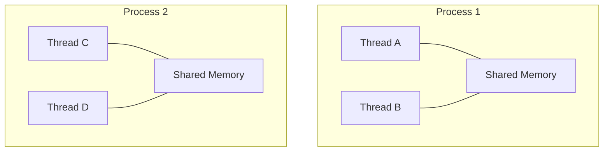
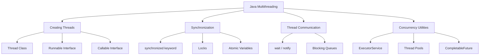
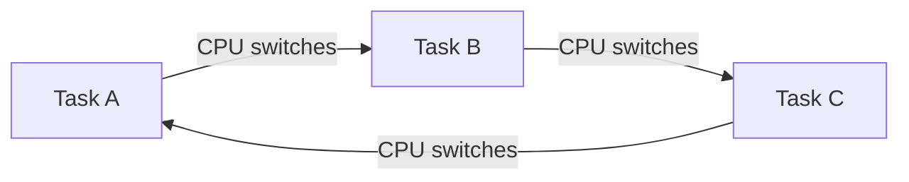
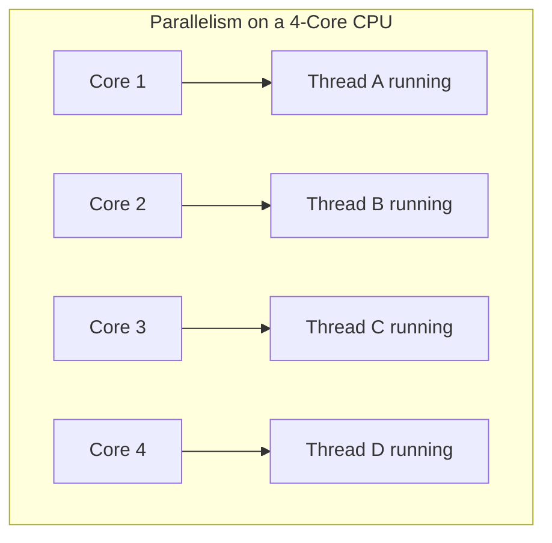
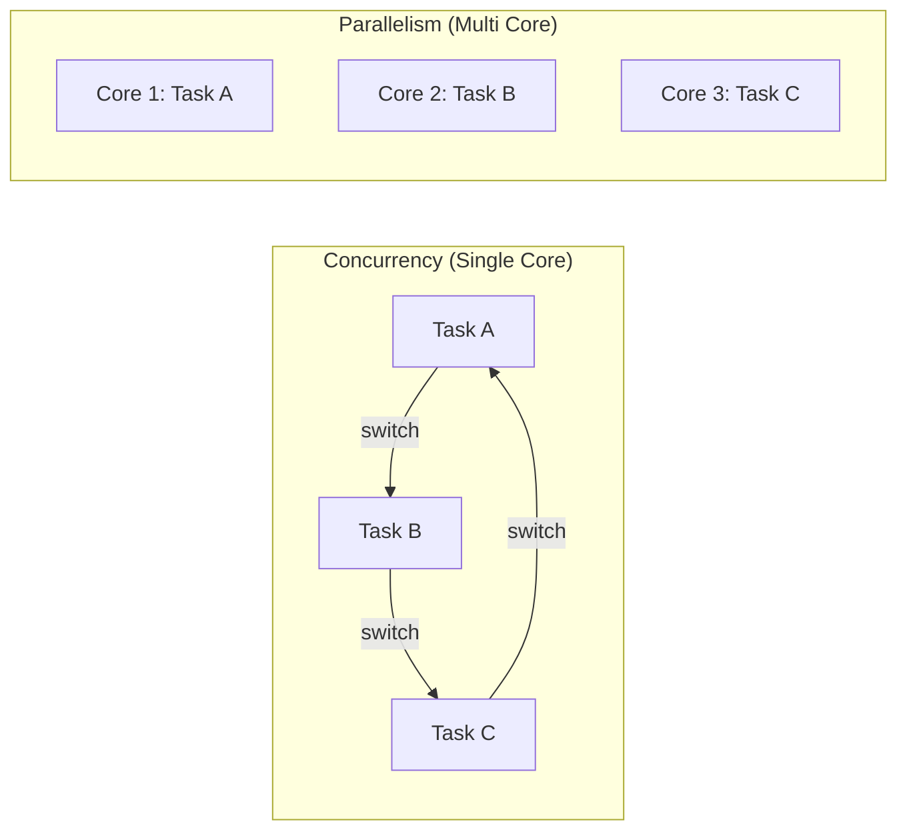

# Multithreading in Java — Complete Notes

---

## 1. Introduction to Multithreading

### 🤔 Before We Begin — What Problem Are We Solving?

Imagine you're at a **restaurant** — but there's only **one waiter** for the entire place.

He takes an order from Table 1, walks to the kitchen, waits for the food to be ready, brings it back, and *only then* moves to Table 2. Meanwhile, Tables 3 through 10 are just sitting there — hungry and frustrated.

Now imagine the restaurant hires **five waiters**. Suddenly, multiple tables are being served at the same time. Orders are taken in parallel, food arrives faster, and customers are happy.

**That's essentially what multithreading does for your Java programs.**

Your program is the restaurant. The waiters are **threads**. And the customers? They're the **tasks** your program needs to get done.

To understand multithreading, we first need to understand three foundational concepts: **Program**, **Process**, and **Thread**. Let's take them one at a time.

---

### 📄 1.1 Program

#### Interview Definition

> **Interview Definition**
>
> A **program** is a set of instructions written in a programming language, stored as a file on disk. It is a passive entity — it doesn't do anything until it is executed. For example, a `.java` file or a compiled `.class` file sitting on your hard drive is a program.

#### Simple Explanation

Think of a program as a **plan on paper**. You've written down step-by-step instructions for what you want the computer to do — but writing them down doesn't make anything happen. The program is just sitting there, lifeless, until someone (the operating system) actually runs it.

Every Java file you've ever written — `HelloWorld.java`, `Calculator.java` — is a program. It only becomes "alive" when you run it.

```
📁 MyApp.java  ←  This is a program (just a file, doing nothing)
```

#### Real-Life Analogy

A program is like a **recipe book** sitting on a kitchen shelf.

The book contains all the instructions to make a delicious pasta — the ingredients, the steps, the timings. But the pasta doesn't cook itself just because the recipe exists. Someone has to open the book, gather the ingredients, and actually *start cooking*.

Until then, the recipe is just ink on paper. That's exactly what a program is — instructions on disk.

#### Technical Explanation

In Java, a program is your source code (`.java` files) or compiled bytecode (`.class` files). When you write:

```java
public class HelloWorld {
    public static void main(String[] args) {
        System.out.println("Hello, World!");
    }
}
```

This file sitting on your disk is a program. It consumes no CPU, no RAM (beyond its file size), and does no work. It's completely static.

The program only comes to life when you execute it with `java HelloWorld` — at which point the JVM loads it into memory and it becomes something new: a **process**.

#### Key Takeaways

- A program is a **static** set of instructions stored on disk.
- It does **nothing** until it is executed.
- In Java, your `.java` and `.class` files are programs.
- Once a program is executed, it becomes a **process**.

---

### ⚙️ 1.2 Process

#### Interview Definition

> **Interview Definition**
>
> A **process** is a running instance of a program. When you execute a program, the operating system loads it into memory, allocates resources like CPU time and RAM, and begins executing it. Each process has its **own separate memory space**, so one process cannot directly access the memory of another.

#### Simple Explanation

If a program is a plan on paper, a process is **that plan being actively carried out**. The moment you double-click an app or type `java MyApp` in the terminal, the operating system creates a process. It gives that process its own private chunk of memory and starts running your code.

You can have **multiple processes** running at the same time — that's what happens when you have Chrome, Spotify, and IntelliJ all open simultaneously. Each one is a separate process with its own memory.

#### Real-Life Analogy

Let's go back to our recipe book analogy.

The recipe book (program) is on the shelf. Now, a **chef walks up, opens the book, and starts cooking**. He grabs a pot, turns on the stove, gathers ingredients — this entire active cooking session is a **process**.

Here's the important part: if another chef also wants to cook from the same recipe book, he gets his **own separate workstation** — his own pot, his own stove, his own ingredients. The two chefs don't share their workspaces. If Chef 1 accidentally burns his sauce, Chef 2's sauce is completely unaffected.

That's how processes work — each one gets its own **isolated memory**, so they can't accidentally interfere with each other.

```
┌──────────────────────┐     ┌──────────────────────┐
│     Process 1        │     │     Process 2        │
│  (Chrome Browser)    │     │  (Spotify Player)    │
│                      │     │                      │
│  Own Memory Space    │     │  Own Memory Space    │
│  Own Resources       │     │  Own Resources       │
│  Isolated from       │     │  Isolated from       │
│  other processes     │     │  other processes     │
└──────────────────────┘     └──────────────────────┘
        ▲                            ▲
        │    Managed by the OS       │
        └────────────────────────────┘
```

#### Technical Explanation

When you run a Java program:

1. The **JVM starts** as a new process on your operating system.
2. The OS allocates a **separate memory space** (heap, stack, etc.) for this process.
3. The JVM loads your `.class` files into this memory.
4. The `main()` method begins executing.

Each Java application you run creates a **separate JVM process**. If you open two terminals and run `java App1` and `java App2`, those are two independent processes — they have no shared memory and cannot directly talk to each other.

You can see running processes on your system:
- **Windows:** Open Task Manager (Ctrl+Shift+Esc) → Processes tab
- **Linux/Mac:** Run `ps aux` or `top` in the terminal

#### Key Takeaways

- A process is a **running instance** of a program.
- Each process gets its **own memory space**, isolated from other processes.
- Running the same program twice creates **two separate processes**.
- The operating system manages and schedules processes.
- In Java, each running application is a separate **JVM process**.

---

### 🧵 1.3 Thread

#### Interview Definition

> **Interview Definition**
>
> A **thread** is the smallest unit of execution within a process. It represents a single, sequential flow of control. Multiple threads within the same process **share the same memory space**, which makes them lightweight and efficient to create, but also means they must coordinate carefully to avoid conflicts. Every Java program has at least one thread — the **main thread** — which executes the `main()` method.

#### Simple Explanation

If a process is a kitchen where cooking happens, a thread is **one individual chef** working inside that kitchen. The chef follows his own set of steps (chop onions, boil water, stir sauce), and each step happens one after another.

Now here's the special part: you can have **multiple chefs (threads) in the same kitchen (process)**. They all share the same counter, the same stove, and the same ingredients. This makes it easy for them to work together — but it also means they need to be careful not to bump into each other or grab the same ingredient at the same time.

When you run a Java program, the JVM always creates at least one thread called the **main thread**. This is the thread that starts executing your `main()` method. Every program you've ever written in Java has been using a thread — you just didn't know it!

#### Real-Life Analogy

Imagine an **office** with one big open room (the process). Inside this room, there are **multiple employees** (threads) working at the same time.

- They all share the **same printer**, the **same whiteboard**, and the **same coffee machine** (shared memory/resources).
- Each employee works on their own task independently (each thread has its own flow of execution).
- But if two employees try to use the printer at the exact same time, there's a problem — paper jams, garbled output. They need some system to **take turns** (this is what synchronization is, which we'll learn later).

```
┌──────────────────────────────────────────────┐
│                  PROCESS                     │
│          (Your running Java app)             │
│                                              │
│   ┌──────────┐  ┌──────────┐  ┌──────────┐  │
│   │ Thread 1 │  │ Thread 2 │  │ Thread 3 │  │
│   │(Employee │  │(Employee │  │(Employee │  │
│   │    1)    │  │    2)    │  │    3)    │  │
│   └──────────┘  └──────────┘  └──────────┘  │
│                                              │
│     Shared Memory (Shared Office Resources)  │
└──────────────────────────────────────────────┘
```

#### Technical Explanation

In Java, when you run a program, the JVM creates the **main thread** automatically. This thread begins execution at the `main()` method:

```java
public class HelloWorld {
    public static void main(String[] args) {
        // This code runs on the "main" thread
        System.out.println("Hello from the main thread!");
        
        // You can verify it:
        System.out.println("Current thread: " + Thread.currentThread().getName());
        // Output: Current thread: main
    }
}
```

Every thread has:

| Property           | Description                                                        |
|--------------------|--------------------------------------------------------------------|
| **Thread ID**      | A unique long number assigned by the JVM                           |
| **Thread Name**    | A human-readable name (e.g., `main`, `Thread-0`)                   |
| **Priority**       | A number from 1–10 that hints at scheduling importance (default: 5)|
| **Stack**          | Its own private call stack (method calls, local variables)          |
| **Shared Heap**    | Access to the same heap memory as other threads in the process     |

> **The critical difference between a process and a thread:** Processes have **separate** memory. Threads within the same process **share** memory. This is what makes threads lightweight (no need to duplicate memory), but also what makes multithreading tricky (shared data can cause bugs).

```
Process vs Thread — Memory Model:

┌─────────────────────────────────────────────────┐
│                    PROCESS                      │
│                                                 │
│   ┌─────────────┐  ┌─────────────┐              │
│   │  Thread 1   │  │  Thread 2   │              │
│   │             │  │             │              │
│   │ Own Stack   │  │ Own Stack   │  ← Private   │
│   │ Own PC      │  │ Own PC      │              │
│   └──────┬──────┘  └──────┬──────┘              │
│          │                │                     │
│          ▼                ▼                     │
│   ┌─────────────────────────────┐               │
│   │       Shared Heap Memory    │  ← Shared     │
│   │    (Objects, Class data)    │               │
│   └─────────────────────────────┘               │
└─────────────────────────────────────────────────┘

PC = Program Counter (tracks which instruction to execute next)
```

#### Key Takeaways

- A thread is the **smallest unit of execution** inside a process.
- All threads in a process **share the same memory** (heap), but each has its **own stack**.
- Every Java program has at least one thread: the **main thread**.
- Threads are **lightweight** compared to processes because they don't need separate memory spaces.
- Shared memory makes threads fast but also introduces risks like **race conditions** (we'll cover this later).

---

### ⚖️ 1.4 Process vs. Thread — Side-by-Side Comparison

Now that we understand both concepts, let's put them side by side:

| Feature              | Process                                    | Thread                                      |
|----------------------|--------------------------------------------|---------------------------------------------|
| **Definition**       | A running instance of a program            | A flow of execution within a process        |
| **Memory**           | Has its own separate memory space          | Shares memory with other threads in the same process |
| **Creation Cost**    | Heavyweight — expensive to create          | Lightweight — cheap to create               |
| **Communication**    | Inter-Process Communication (IPC) needed   | Can communicate directly via shared memory  |
| **Isolation**        | Fully isolated — one crash doesn't affect others | Not isolated — one thread crash can kill the entire process |
| **Example**          | Chrome and Spotify running simultaneously  | Multiple tabs within one Chrome window      |



> **Notice:** Threads within the same process share memory, but threads in different processes have completely separate memory spaces.

---

### 🚶 1.5 Single-Threaded Execution

#### Interview Definition

> **Interview Definition**
>
> **Single-threaded execution** means a program uses only **one thread** to run all its tasks. Tasks are performed **sequentially** — one after another. The next task cannot begin until the current task finishes. This makes the program simple to write and debug, but it can be **slow and inefficient** because the CPU sits idle during waiting operations and only one core is utilized.

#### Simple Explanation

In a single-threaded program, everything happens in a **straight line**. Task A runs to completion, then Task B starts, then Task C, and so on. It's like having a single queue at a billing counter — everybody waits in line, no matter how long the person in front takes.

This is how all the Java programs you've written so far have worked. Your `main()` method runs line by line, top to bottom, one instruction at a time. And for simple programs, that's perfectly fine.

But for real-world applications that need to download files, respond to user clicks, and update the screen — all at the same time? A single thread just can't keep up.

#### Real-Life Analogy

Imagine a **doctor's clinic** with only **one doctor** and no assistants.

The doctor has to:
1. Call the patient in
2. Listen to the symptoms
3. Write a prescription
4. Walk to the pharmacy, get the medicine, come back
5. Give the medicine to the patient
6. *Only then* call the next patient

While the doctor is walking to the pharmacy (a slow, waiting task), the **entire clinic is frozen**. No other patient is being seen. Everyone just waits.

That's exactly what happens in a single-threaded program when it hits a slow operation (like a network call or file download) — the entire program freezes.

#### Technical Explanation

```
Single-Threaded Execution (Sequential):

Time ──────────────────────────────────────────────►

 ┌────────────────┐┌────────────────┐┌────────────────┐
 │   Task A       ││   Task B       ││   Task C       │
 │  (Download     ││  (Process      ││  (Save to      │
 │   a file)      ││   data)        ││   database)    │
 └────────────────┘└────────────────┘└────────────────┘

 ◄──── 5 sec ────►◄──── 3 sec ────►◄──── 2 sec ────►

                 Total time: 10 seconds
```

The three major problems with single-threaded execution:

**1. Wasted time during waiting (CPU sits idle):**

If Task A is downloading a file from the internet, the CPU is mostly just *waiting* for the network to respond. It could be doing something useful instead — but the single thread is blocked.

**2. Frozen user interfaces:**

Ever clicked a button in an app and it completely froze? That's because the single thread was busy doing something else (like loading data from a database) and couldn't respond to your click. The UI becomes unresponsive.

**3. Underutilization of modern hardware:**

Your computer likely has 4, 8, or even 16 CPU cores. A single-threaded program uses only **one** of them. The rest sit completely idle — like having a 16-lane highway but only allowing one car on it.

```
Your CPU cores in a single-threaded program:

   Core 1:  ████████████████████  (doing all the work)
   Core 2:  ░░░░░░░░░░░░░░░░░░░░  (idle... 😴)
   Core 3:  ░░░░░░░░░░░░░░░░░░░░  (idle... 😴)
   Core 4:  ░░░░░░░░░░░░░░░░░░░░  (idle... 😴)

   █ = Working    ░ = Idle
```

#### Key Takeaways

- Single-threaded programs execute tasks **one at a time**, sequentially.
- The CPU **wastes time** sitting idle during blocking operations (I/O, network).
- The UI can **freeze** if the single thread is busy with a long task.
- Only **one CPU core** is used — the rest are wasted.
- It's **simple** to write and debug, but doesn't scale for real-world apps.

---

### 🚀 1.6 Multithreading

#### Interview Definition

> **Interview Definition**
>
> **Multithreading** is a programming concept where multiple threads run within the same process, allowing multiple tasks to make progress simultaneously. It improves application performance by utilizing CPU resources more efficiently, keeps the UI responsive, and allows better use of multi-core processors. Java has **built-in support** for multithreading from the very beginning.

#### Simple Explanation

Multithreading is the opposite of single-threading. Instead of doing one thing at a time, your program can do **multiple things at once** (or at least appear to). You create multiple threads, assign each one a task, and they all run together.

This is what lets Spotify play music while also updating the progress bar and loading the next song. It's what lets IntelliJ compile your code in the background while you keep typing. It's what lets a web server handle thousands of users at the same time.

#### Real-Life Analogy

Let's go back to our doctor's clinic — but this time, the clinic has **three doctors and two assistants**.

- Doctor 1 is seeing Patient A.
- Doctor 2 is seeing Patient B.
- An assistant walks to the pharmacy (so the doctor doesn't have to leave).
- Doctor 3 is writing prescriptions for earlier patients.

Now multiple patients are being served at the same time. The clinic is faster, more efficient, and nobody has to wait as long. That's multithreading in action.

#### Technical Explanation

With multithreading, instead of running tasks one after another, we assign each task to a separate thread and let them run simultaneously:

```
Multithreaded Execution (Concurrent / Parallel):

Time ──────────────────────────────────────────────►

 Thread 1: ┌────────────────┐
            │   Task A       │
            │  (Download)    │
            └────────────────┘
 Thread 2: ┌────────────────┐
            │   Task B       │
            │  (Process)     │
            └────────────────┘
 Thread 3: ┌────────────────┐
            │   Task C       │
            │  (Save to DB)  │
            └────────────────┘

            ◄──── 5 sec ────►

          Total time: ~5 seconds (instead of 10!)
```

Now our CPU cores are actually being used:

```
Your CPU cores in a multithreaded program:

   Core 1:  ████████████████████  (Task A)
   Core 2:  ████████████████████  (Task B)
   Core 3:  ████████████████████  (Task C)
   Core 4:  ░░░░░░░░░░░░░░░░░░░░  (available for other work)

   Now we're actually using our hardware! 💪
```

**A concrete example — Music Player:**

Without multithreading:
```
Single-threaded music player:

  Play audio ───────────────────────────────────►
                    ↑
                    Can't update the UI,
                    can't respond to "Next" button,
                    can't load the next song...

                    App appears FROZEN! ❄️
```

With multithreading:
```
Multithreaded music player:

  Thread 1: Play audio       ────────────────────►
  Thread 2: Update UI        ────────────────────►
  Thread 3: Load next song   ────────────────────►
  Thread 4: Listen for input ────────────────────►

  Everything works smoothly! ✨
```

Java was designed with multithreading in mind from the very beginning. Unlike some other languages where threading was added later, Java has **built-in support** for multithreading right in the language core.

Here's a bird's-eye view of what Java gives you:



> **Don't worry** if these terms don't make sense yet — we'll cover each one in detail in the upcoming sections. For now, just know that Java gives you a rich toolkit for working with threads.

#### Key Takeaways

- Multithreading lets you run **multiple tasks simultaneously** within one process.
- It improves **performance** by utilizing multiple CPU cores.
- It keeps the **UI responsive** by running heavy tasks on background threads.
- Java has had **built-in multithreading support** since its very first version (Java 1.0).
- It's powerful but introduces **complexity** — race conditions, deadlocks, and synchronization challenges (covered later).

---

### 🔄 1.7 Concurrency

#### Interview Definition

> **Interview Definition**
>
> **Concurrency** means multiple tasks are *in progress* during the same time period, but they are not necessarily executing at the same instant. On a single-core CPU, concurrency is achieved through **context switching** — the CPU rapidly switches between tasks, giving the illusion that they are running simultaneously. Concurrency is about **dealing with** many things at once, not necessarily **doing** them at once.

#### Simple Explanation

Concurrency doesn't mean everything is happening at the exact same moment. It means that multiple tasks are being **managed** at the same time — they're all "in progress" — even if only one is actively running at any given instant.

Think of it like a single person who's cooking dinner, answering the phone, and keeping an eye on the laundry. They're not doing all three *simultaneously* — they're switching between them. But all three are "in progress" at the same time.

#### Real-Life Analogy

Imagine a **single juggler** keeping three balls in the air.

At any given instant, the juggler is only touching **one ball**. But he switches between them so fast — catch, toss, catch, toss — that it *looks* like he's handling all three at once.

The balls are the tasks. The juggler is the CPU core. The rapid switching is **context switching**.

The key idea: the juggler is only doing **one thing at a time**, but he's keeping all three balls "in progress." That's concurrency.

```
Concurrency (Single-Core CPU):

Time ──────────────────────────────────────────────────────►

CPU:  ┌──T1──┐┌──T2──┐┌──T3──┐┌──T1──┐┌──T2──┐┌──T3──┐──►
      └──────┘└──────┘└──────┘└──────┘└──────┘└──────┘

      The CPU rapidly switches between tasks.
      Only ONE task runs at any instant.
      But all three are "in progress."
```

#### Technical Explanation

Concurrency is achieved even on a **single-core CPU** through a technique called **time-slicing** (also known as **context switching**). Here's what happens:

1. The CPU runs **Thread 1** for a small slice of time (e.g., a few milliseconds).
2. It pauses Thread 1, saves its state (where it was in the code, its variables, etc.).
3. It loads the state of **Thread 2** and runs it for a small time slice.
4. It pauses Thread 2, saves its state, loads **Thread 3**, and so on.

This happens so fast (thousands of times per second) that to us humans, it *appears* as though all three threads are running at the same time. But the CPU is really just one very fast juggler.



> The operating system's **thread scheduler** is responsible for deciding which thread gets CPU time, for how long, and in what order. In Java, you don't control this directly — the JVM works with the OS scheduler.

#### Key Takeaways

- Concurrency means multiple tasks are **in progress** at the same time, but not necessarily executing simultaneously.
- It's achieved through **rapid context switching** by the CPU.
- A **single-core** CPU can achieve concurrency (but not true parallelism).
- The thread scheduler (managed by the OS) decides which thread runs when.
- Concurrency is about **managing** multiple tasks, not about doing them all at the exact same instant.

---

### ⚡ 1.8 Parallelism

#### Interview Definition

> **Interview Definition**
>
> **Parallelism** means multiple tasks are literally **executing at the same instant**, each on a different CPU core. Unlike concurrency, which can happen on a single core through switching, parallelism requires **multi-core hardware**. In parallelism, if you have 4 cores, up to 4 threads can truly run at the exact same moment. Parallelism is about **doing** many things at once.

#### Simple Explanation

If concurrency is one person juggling three balls, parallelism is **three people each holding one ball**. All three balls are genuinely being held — at the exact same moment. No switching needed.

For parallelism to work, you need multiple "workers" — in computer terms, that means **multiple CPU cores**. Each core runs a thread independently, at the same time, for real.

#### Real-Life Analogy

Imagine a **supermarket** with three billing counters, each with its own cashier.

- Counter 1 is billing Customer A.
- Counter 2 is billing Customer B.
- Counter 3 is billing Customer C.

All three are being processed **at the exact same time** — truly in parallel. Nobody is waiting, nobody is switching. That's parallelism.

Compare this to one cashier switching between three counters (concurrency). It works, but it's not truly simultaneous.

```
Parallelism (Multi-Core CPU):

Time ──────────────────────────────────────────────────────►

Core 1:  ┌──────── Thread 1 ────────┐
Core 2:  ┌──────── Thread 2 ────────┐  ← All running at
Core 3:  ┌──────── Thread 3 ────────┐     the SAME time!
Core 4:  ░░░░░░░░░░░░░░░░░░░░░░░░░░░  (idle)
```

#### Technical Explanation

Modern CPUs have multiple cores (2, 4, 8, 16, or more). Each core is like a separate mini-processor that can independently execute a thread.

When your Java program creates multiple threads and the hardware has multiple cores, the operating system can **schedule each thread on a different core**, achieving true parallelism:



> **Important:** You don't explicitly assign threads to cores in Java. The JVM and the OS handle this automatically. You just create the threads — the system decides whether to run them concurrently (switching on one core) or in parallel (on multiple cores) based on available hardware.

#### Key Takeaways

- Parallelism means tasks are running at the **exact same instant** on different CPU cores.
- It requires **multi-core hardware** — one core per simultaneous thread.
- Parallelism is a subset of concurrency — all parallelism is concurrent, but not all concurrency is parallel.
- In Java, you **don't control** which core runs which thread — the OS does.
- True parallelism gives the biggest performance boost for CPU-intensive tasks.

---

### 🔀 1.9 Concurrency vs. Parallelism — The Key Difference

Now that we've defined both individually, let's put them head-to-head:

| Aspect        | Concurrency                              | Parallelism                                |
|---------------|------------------------------------------|--------------------------------------------|
| **What?**     | Multiple tasks making progress           | Multiple tasks running at the same instant |
| **How?**      | Rapid switching between tasks (context switching) | Multiple CPU cores working simultaneously  |
| **Requires?** | At least 1 CPU core                      | Multiple CPU cores                         |
| **Analogy**   | One juggler switching between balls      | Three jugglers each holding a ball         |
| **Focus**     | **Managing** many things at once         | **Doing** many things at once              |



> **The good news:** When you write multithreaded Java code, you don't need to explicitly choose between concurrency and parallelism. The JVM and the operating system decide based on available hardware. If you have multiple cores, your threads may run in parallel. If you have a single core, they'll run concurrently. You just create the threads — the system handles the rest.

---

### ⏱️ 1.10 Context Switching

#### Interview Definition

> **Interview Definition**
>
> **Context switching** is the process of saving the current state of a running thread (its program counter, registers, stack data) and loading the saved state of another thread so the CPU can switch from executing one thread to another. It enables concurrency on single-core CPUs, but it has a **small performance overhead** — the CPU spends time switching rather than doing actual work.

#### Simple Explanation

When a CPU core needs to stop working on one thread and start working on another, it can't just jump. It needs to **save its place** in the current thread (like putting a bookmark in a book) and **find its place** in the next thread (like finding the bookmark in a different book). This save-and-load process is called a context switch.

Context switches are fast — they happen in microseconds — but they're not free. If you have too many threads and the CPU spends more time switching than working, your program actually gets *slower*. This is called **thrashing**.

#### Real-Life Analogy

Imagine you're **reading three books at the same time** (maybe a novel, a textbook, and a comic).

Every 5 minutes, someone tells you to switch books. Here's what you have to do:
1. **Bookmark** your current page in the novel.
2. **Put down** the novel.
3. **Pick up** the textbook.
4. **Find your bookmark** in the textbook.
5. **Start reading** from where you left off.

That whole bookmark-switch-find process takes time. You're not reading during that time — you're just switching. If someone makes you switch every 30 seconds instead of every 5 minutes, you'd spend more time *switching* than actually *reading*.

That's the overhead of context switching.

#### Technical Explanation

Here's what happens during a context switch at the system level:

```
Context Switching Visualized:

CPU Core 1:
    ┌──────┐ save ┌──────┐ save ┌──────┐ save ┌──────┐
    │  T1  │──────│  T2  │──────│  T3  │──────│  T1  │──►
    └──────┘ load └──────┘ load └──────┘ load └──────┘

    T1, T2, T3 = Different Threads

    Each "save/load" is a context switch.
    It's fast (microseconds), but not free.
```

During each context switch, the OS must:

1. **Save** the state of the current thread:
   - Program Counter (which instruction was being executed)
   - CPU Registers (temporary data the thread was working with)
   - Stack Pointer (where the thread's stack data is in memory)

2. **Load** the saved state of the next thread:
   - Restore its Program Counter, Registers, and Stack Pointer

3. **Flush** certain CPU caches, which means the new thread may start with "cold" caches (slower initial memory access)

The overhead per context switch is small (a few microseconds), but it adds up:

```
                  Too few threads          Sweet spot           Too many threads
                  ┌──────────┐          ┌──────────┐          ┌──────────┐
  Performance:    │  Under-   │          │ Optimal  │          │ Thrash-  │
                  │ utilized  │  ──►──►  │  ⭐⭐⭐  │  ──►──►  │  ing!    │
                  └──────────┘          └──────────┘          └──────────┘
```

#### Key Takeaways

- Context switching is the **save-and-load** process when the CPU switches between threads.
- It enables **concurrency** on single-core CPUs but has a **performance cost**.
- Each switch involves saving/restoring the **program counter, registers, and stack pointer**.
- Too many threads → too many context switches → **thrashing** (performance degrades).
- Finding the right number of threads is key — this is why **thread pools** exist (covered later).

---

### 🌍 1.11 Where is Multithreading Used in the Real World?

Multithreading isn't just a theoretical concept — it's **everywhere** in the software you use daily:

| Application             | How Multithreading is Used                                                                    |
|--------------------------|--------------------------------------------------------------------------------------------  |
| **🌐 Web Browsers**     | One thread renders the page, another loads images, another handles your clicks               |
| **🎮 Video Games**      | One thread for graphics rendering, one for physics, one for audio, one for user input        |
| **💻 IDEs (IntelliJ)**  | One thread for the editor, another for code analysis, another for building in the background |
| **🎵 Music Players**    | One thread plays the audio, another updates the progress bar, another loads the next song    |
| **🌐 Web Servers**      | Each incoming request from a user is handled by a separate thread                            |
| **💬 Chat Apps**        | One thread listens for incoming messages, another sends your messages, another updates the UI|
| **📱 Android Apps**      | The "main" thread handles UI; background threads fetch data from APIs                       |

---

### ⚠️ 1.12 Challenges of Multithreading — A Preview

If multithreading is so great, why not use it for *everything*? Because it comes with its own set of challenges that you need to understand:

| Challenge                    | What Happens                                                                                          | Analogy                                                                                      |
|------------------------------|-------------------------------------------------------------------------------------------------------|----------------------------------------------------------------------------------------------|
| **Complexity**               | Multithreaded code is harder to write, read, and debug. Bugs can be subtle and hard to reproduce.     | Managing 10 employees is harder than managing 1.                                             |
| **Race Conditions**          | Two threads try to modify the same data at the same time → unexpected results.                        | Two chefs both reaching for the last egg — who gets it?                                      |
| **Deadlocks**                | Two threads wait for each other forever → the program hangs.                                          | Two people at a narrow doorway: "You go first." "No, *you* go first." Neither moves.         |
| **Context Switching Overhead** | Too many threads → the CPU spends more time switching than working.                                 | Switching books every 5 seconds — you're just flipping pages, never reading.                 |

> **The takeaway:** Multithreading is a powerful tool, but like any powerful tool, it needs to be used wisely. We'll learn how to handle each of these challenges in upcoming sections. As Uncle Ben said, *"With great power comes great responsibility."* 🕷️

---

### 📝 1.13 Section Summary

Let's recap every concept we covered in this introduction:

| Concept                    | Key Takeaway                                                                                    |
|----------------------------|-------------------------------------------------------------------------------------------------|
| **Program**                | A set of instructions on disk — does nothing until executed                                     |
| **Process**                | A running instance of a program with its own isolated memory                                   |
| **Thread**                 | A single flow of execution inside a process — shares memory with other threads                 |
| **Single-Threaded**        | One task at a time — simple but slow, wastes CPU cores, can freeze UI                          |
| **Multithreading**         | Multiple tasks in progress at once — faster, responsive UI, uses hardware efficiently          |
| **Concurrency**            | Tasks making progress in overlapping time periods — managing many things at once (juggling)     |
| **Parallelism**            | Tasks running at the exact same instant on different cores — doing many things at once          |
| **Context Switching**      | The save/load overhead when the CPU switches between threads                                   |

---

### ➡️ What's Next?

Now that you understand *why* multithreading exists and *what* it is at a high level, we're ready to get our hands dirty with code. In the next section, we'll learn:

- **How to create threads** in Java (using the `Thread` class and `Runnable` interface)
- **The thread lifecycle** — the different states a thread goes through
- **Writing your first multithreaded program**

---
