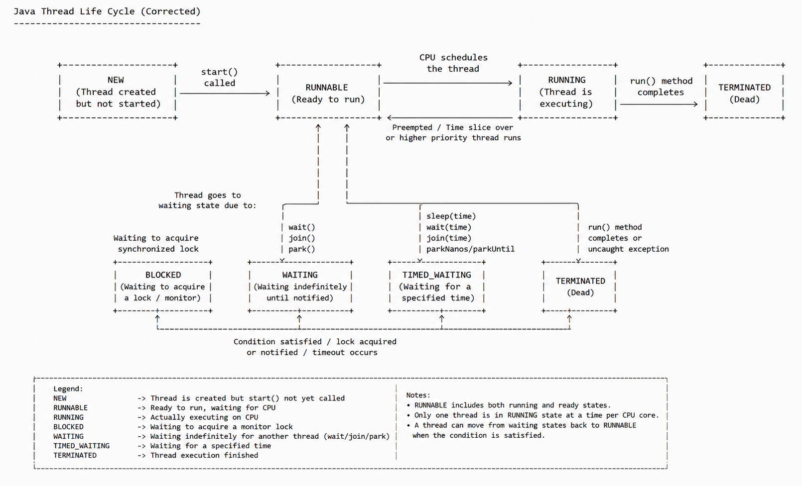

# Multithreading in Java — Complete Notes

---

## 📑 Index

1. [Introduction to Multithreading](#1-introduction-to-multithreading)
2. [Difference Between Process vs Thread](#2-difference-between-process-and-thread)
3. [Thread Life Cycle in Java](#3-thread-life-cycle-in-java)
4. [Different Cases of Executing Threads in Java](#4-different-cases-of-executing-threads-in-java)
5. [Java Thread Class Methods](#5-java-thread-class-methods)

---

## 1. Introduction to Multithreading

### 🤔 Before We Begin — What Problem Are We Solving?

Imagine you're at a **restaurant** — but there's only **one waiter** for the entire place. 

He takes an order from Table 1, walks to the kitchen, waits for the food to be ready, brings it back, and *only then* moves to Table 2. Meanwhile, Tables 3 through 10 are just sitting there — hungry and frustrated.

> Now imagine the restaurant hires **five waiters**. Suddenly, multiple tables are being served at the same time. Orders are taken in parallel, food arrives faster, and customers are happy.

**That's essentially what multithreading does for your Java programs.**

> Your program is the restaurant. The waiters are **threads**. And the customers? They're the **tasks** your program needs to get done.

---

### 📖 What is a Program, a Process, and a Thread?

Before jumping into multithreading, let's nail down three terms you'll hear constantly. Think of them as three levels of zoom:

#### Program

A **program** is a **set of instructions** written in a programming language, **stored as a file on disk**. It is a **passive entity** — it **doesn't do anything until it is executed**. For example, a .java file or a compiled .class file sitting on your hard drive is a program.

```
📁 MyApp.java  ←  This is a program (just a file, doing nothing)
```

#### Process

A **process** is a **running instance of a program**. When you **run** that program, the **operating system loads it into memory** and starts executing it. Now it becomes a **process**

Think of it like this: the recipe book is still on the shelf, but now a **chef has opened it and started cooking**. That active cooking session is a process.

> A process gets **its own chunk of memory**, **its own resources**, and is **managed by the operating system**.

#### Thread

A **thread** is the **smallest unit of execution** within a process that the **CPU can schedule and run**.

> If a process is a **kitchen**, then a thread is a **single chef** working in that kitchen. You can have one chef (single-threaded) or many chefs working together (multithreaded).

```
┌──────────────────────────────────────────────┐
│                  PROCESS                     │
│          (Your running Java app)             │
│                                              │
│   ┌──────────┐  ┌──────────┐  ┌──────────┐  │
│   │ Thread 1 │  │ Thread 2 │  │ Thread 3 │  │
│   │ (Chef 1) │  │ (Chef 2) │  │ (Chef 3) │  │
│   └──────────┘  └──────────┘  └──────────┘  │
│                                              │
│        Shared Memory (Shared Kitchen)        │
└──────────────────────────────────────────────┘
```

> **Key insight:** All threads within a process **share the same memory space** (like chefs sharing the same kitchen counter and ingredients). This is what makes threads lightweight and fast — but it's also what makes multithreading tricky (more on that later).

#### Quick Comparison

| Concept     | Real-Life Analogy           | Key Characteristic                                  |
|-------------|-----------------------------|------------------------------------------------------|
| **Program** | A recipe book on a shelf    | Static, just instructions, not running               |
| **Process** | A kitchen actively cooking  | Running instance, has its own memory & resources     |
| **Thread**  | A single chef in the kitchen| A flow of execution inside a process, shares memory  |

---

### 🧵 What Exactly is a Thread?

Let's zoom in a little more.

A **thread** is simply a **sequence of instructions** that can be executed independently. When your Java program starts, **the JVM automatically creates one thread for you** — the **main thread**. This is the thread that begins executing your `main()` method.

```java
public class HelloWorld {
    public static void main(String[] args) {
        // This code runs on the "main" thread
        System.out.println("Hello from the main thread!");
    }
}
```

Even this simple program **uses a thread** — you just never had to think about it before!

---

### 🚶 Single-Threaded Execution — One Thing at a Time

In a **single-threaded** program, tasks are done **one after another**, like a single queue at a billing counter. Task 2 can't start until Task 1 finishes. Task 3 waits for Task 2. And so on.

```
Single-Threaded Execution (Sequential):

Time ──────────────────────────────────────────►

 ┌────────────────┐┌────────────────┐┌────────────────┐
 │   Task A       ││   Task B       ││   Task C       │
 │  (Download     ││  (Process      ││  (Save to      │
 │   a file)      ││   data)        ││   database)    │
 └────────────────┘└────────────────┘└────────────────┘

 ◄──── 5 sec ────►◄──── 3 sec ────►◄──── 2 sec ────►

                Total time: 10 seconds
```

Everything happens in a straight line. Simple? Yes. Efficient? **Not always.**

#### The Problems with Single-Threaded Execution

1. **Wasted time during waiting:** If Task A is downloading a file from the internet, the CPU is mostly just *waiting* for the network. It could be doing something useful instead.

2. **Frozen user interfaces:** Ever clicked a button in an app and it froze? That's because the single thread was **busy doing something else** (like loading data) and **couldn't respond to your click**.

3. **No use of modern hardware:** Your computer likely has 4, 8, or even 16 CPU cores. A single-threaded program uses only **one** of them. The rest sit idle — like having a 16-lane highway but only allowing one car on it.

```
Your CPU cores in a single-threaded program:

   Core 1:  ████████████████████  (doing all the work)
   Core 2:  ░░░░░░░░░░░░░░░░░░░░  (idle... 😴)
   Core 3:  ░░░░░░░░░░░░░░░░░░░░  (idle... 😴)
   Core 4:  ░░░░░░░░░░░░░░░░░░░░  (idle... 😴)

   █ = Working    ░ = Idle
```

---

### 🚀 Multithreaded Execution — Doing Multiple Things at Once

**Multithreading** means having **multiple threads** running within the same process, so multiple tasks can make progress at the same time.

> **Definition :**

**Multithreading** is a programming concept where **multiple threads run within the same process,** allowing multiple tasks to make progress simultaneously. It **improves application performance** by **utilizing CPU resources more efficiently**, **keeps the UI responsive**, and allows **better use of multi-core processors**. **Java has built-in support for multithreading from the very beginning.**

Going back to our earlier example:

```
Multithreaded Execution (Concurrent / Parallel):

Time ──────────────────────────────────────────►

 Thread 1: ┌────────────────┐
            │   Task A       │
            │  (Download)    │
            └────────────────┘
 Thread 2: ┌────────────────┐
            │   Task B       │
            │  (Process)     │
            └────────────────┘
 Thread 3: ┌────────────────┐
            │   Task C       │
            │  (Save to DB)  │
            └────────────────┘

            ◄──── 5 sec ────►

          Total time: ~5 seconds (instead of 10!)
```

Now the same work gets done in roughly **half the time** because tasks run in parallel, not one after another.

```
Your CPU cores in a multithreaded program:

   Core 1:  ████████████████████  (Task A)
   Core 2:  ████████████████████  (Task B)
   Core 3:  ████████████████████  (Task C)
   Core 4:  ░░░░░░░░░░░░░░░░░░░░  (available for other work)

   Now we're actually using our hardware! 💪
```

---

### ⏱️ What is Context Switching?

We mentioned **context switching** above. Let's make sure it's crystal clear.

When a CPU core has to switch from running one thread to another, it needs to:

1. **Save** the current state of Thread A (where it was in the code, what variables it was using, etc.)
2. **Load** the saved state of Thread B
3. **Resume** Thread B from where it left off

This entire process is called a **context switch**.

```
Context Switching Visualized:

CPU Core 1:
    ┌──────┐ save ┌──────┐ save ┌──────┐ save ┌──────┐
    │  T1  │──────│  T2  │──────│  T3  │──────│  T1  │──►
    └──────┘ load └──────┘ load └──────┘ load └──────┘
    
    T1, T2, T3 = Different Threads
    
    Each "save/load" is a context switch.
    It's fast, but not free — there's a small overhead.
```

> **Think of it like this:** You're reading a novel, but every 5 minutes someone hands you a different book. You have to bookmark your page, pick up the new book, find your bookmark in *that* book, and continue reading. That "bookmark, switch, find" process is the overhead of context switching.

---

### 🌍 Where is Multithreading Used in the Real World?

Multithreading isn't just a theoretical concept — it's **everywhere** in the software you use daily:

| Application             | How Multithreading is Used                                                                 |
|--------------------------|--------------------------------------------------------------------------------------------|
| **🌐 Web Browsers**     | One thread renders the page, another loads images, another handles your clicks              |
| **🎮 Video Games**      | One thread for graphics rendering, one for physics, one for audio, one for user input       |
| **💻 IDEs (IntelliJ)**  | One thread for the editor, another for code analysis, another for building in the background |
| **🎵 Music Players**    | One thread plays the audio, another updates the progress bar, another loads the next song   |
| **🌐 Web Servers**      | Each incoming request from a user is handled by a separate thread                           |
| **💬 Chat Apps**        | One thread listens for incoming messages, another sends your messages, another updates the UI|
| **📱 Android Apps**      | The "main" thread handles UI; background threads fetch data from APIs                       |

#### A Concrete Example — Music Player

Let's say you're building a simple music player in Java. Without multithreading:

```
Single-threaded music player:

  Play audio ───────────────────────────────────►
                    ↑
                    Can't update the UI, 
                    can't respond to "Next" button,
                    can't load the next song...
                    
                    App appears FROZEN! ❄️
```

With multithreading:

```
Multithreaded music player:

  Thread 1: Play audio      ────────────────────►
  Thread 2: Update UI       ────────────────────►
  Thread 3: Load next song  ────────────────────►
  Thread 4: Listen for input ───────────────────►

  Everything works smoothly! ✨
```

---

## 2. Difference between Process and Thread

### 🏠 Simple Analogy

Think of a **process** as a **house**.

- Each house has its own rooms, electricity, water, and storage.
- One house is mostly separate from another house.

Think of a **thread** as a **person working inside that house**.

- Multiple people can work inside the same house.
- They share the same rooms and resources.
- Because they share things, they **must coordinate properly**.

So:

```text
Process = Independent running program
Thread  = Small worker inside a process
```

---

### 📊 Detailed Comparison Table

| Point | Process | Thread | Simple Explanation |
|---|---|---|---|
| Basic meaning | A **process** is a **program in execution state**. | A **thread** is a **subpart of a process** and is the **smallest unit of execution** within a program. | When you open an application, the **operating system creates a process**. Inside that process, one or more **threads do the actual work**. |
| Weight | Process is **heavyweight**. | Thread is **lightweight**. | A process needs **more separate resources** from the operating system, while a thread uses many resources already available in its process. |
| Resource ownership | A process **owns resources** such as **memory address space, code, open files/handles**, and other operating-system resources. | A thread does **not own** a full separate resource set like a process; it **shares the process resources**. | Process is like a **full house with its own resources**. Thread is like a **worker inside that house**. |
| Address space | Each process has a **different/private address space**. | Threads of the same process share the **same address space**. | Processes are **more isolated**. Threads can access the **same memory area** inside their process. |
| Dependency | Processes are generally **independent** of each other. | Threads are generally **dependent** on each other because they exist inside the same process and share resources. | If one process crashes, another separate process may continue. But **if a process ends, all its threads end with it**. |
| Context switching | Process context switching usually takes **more time**. | Thread context switching usually takes **less time**. | Switching between processes is **heavier** because the operating system may need to switch more process-related information, such as memory context. Switching between threads of the same process is usually **lighter**. |
| What is context switching? | The **CPU stops executing one process** and **starts executing another process**. | The **CPU stops executing one thread** and **starts executing another thread**. | It happens **so fast** that users feel **multiple tasks are running at the same time**. |
| Communication | Inter-process communication usually takes **more time**. | Inter-thread communication usually takes **less time**. | Processes have **separate memory**, so they need mechanisms like **pipes, sockets, files, shared memory, or message queues**. Threads share memory, so communication can be faster, but it **must be handled carefully**. |
| Synchronization | Processes usually do not need synchronization if they **do not share data**. However, if processes share files, databases, shared memory, or other common resources, **synchronization may be required**. | Threads **may require synchronization**, especially when multiple threads **access or modify the same shared resource**. | The original point is mostly true for independent processes, but **not always true when shared resources are involved**. |
| Synchronization issue example | If two processes write to the same file at the same time, data can still become **inconsistent unless access is controlled**. | If multiple threads write to the same file or same variable at the same time, they may **corrupt data or produce unexpected results**. | Example: one thread is writing to a file while another thread closes the same file. To avoid this, **we use synchronization**. |
| Resource consumption | Resource consumption is **more** in a process. | Resource consumption is **less** in a thread. | Creating and managing a process needs **more memory and operating-system resources**. Threads are **cheaper** because they share many resources of the process. |
| Time of creation | Process requires **more time** for creation. | Thread requires **less time** for creation. | Starting a new process is like **setting up a new house**. Starting a new thread is like **assigning another worker** inside the same house. |
| Isolation and safety | Processes are **more isolated and safer** from each other. | Threads are **less isolated** because they **share the same process memory**. | **A bug in one thread can affect other threads** in the same process more easily. |
| Failure impact | Failure of one process usually **does not directly corrupt** another process. | Failure of one thread **can affect the entire process and other threads inside it**. | Since threads share memory, **one faulty thread can damage shared data** used by others. |
| Example | Opening Chrome, IntelliJ IDEA, VS Code, or a Java application creates processes. | A Java application may use separate threads for main logic, background tasks, file download, request handling, etc. | **Process is the running application. Threads are workers inside that application.** |

---

### 🔗 Multithreading Connection

In Java, when we talk about **multithreading**, we mean using multiple threads inside the same process.

```text
Java Application Process
│
├── Main Thread
├── File Download Thread
├── Music Playback Thread
└── User Interface Thread
```

All these threads belong to the **same Java process**, but they can **perform different tasks**.

---

### 🔒 Why Threads Need Synchronization

**Threads share the same memory of a process.** This is useful because **sharing data becomes easy**, but it also **creates risk**.

```text
Thread 1: Writing to file
Thread 2: Closing the same file
```

If both happen at the same time **without control**, the program **may behave incorrectly**.

That is why we use synchronization mechanisms such as:

- `synchronized` in Java
- Locks
- Thread-safe collections
- Atomic variables
- Semaphores

---

### 📝 Quick Summary

| Process | Thread |
|---|---|
| Independent running program | Small execution unit inside a process |
| Heavyweight | Lightweight |
| Has separate address space | Shares address space with other threads in same process |
| Communication is slower | Communication is faster |
| Creation takes more time | Creation takes less time |
| More resource consumption | Less resource consumption |
| More isolated | Less isolated |
| Usually safer from other processes | Needs careful synchronization when sharing data |

---

### 💡 One-Line Definition

> A **process** is a running program with its own resources, while a **thread** is a lightweight worker inside a process that shares the process resources.

---

## 3. Thread Life Cycle in Java

### 🛠️ Two Ways to Create Threads in Java

Before seeing a full example, let's quickly cover the two ways to create threads. Both approaches are valid — choose whichever fits your need.

---

#### Way 1 — Extending the `Thread` class

**Steps:**

1. Create a class that **extends** the `Thread` class (from `java.lang` package).
2. **Override** the `run()` method — this is where you write the task.
3. Create an **object** of your class.
4. Call the `start()` method to begin execution.

```java
// Step 1: Extend the Thread class
class MyThread extends Thread {

    // Step 2: Override the run() method
    @Override
    public void run() {
        for (int i = 1; i <= 5; i++) {
            System.out.println("Thread running: " + i);
        }
    }
}

public class Main {
    public static void main(String[] args) {

        // Step 3: Create an object of the class
        MyThread t1 = new MyThread();

        // Step 4: Start the thread
        t1.start();    // ✅ Thread moves from NEW → RUNNABLE → RUNNING

        // t1.start(); // ❌ Calling start() again throws IllegalThreadStateException!
    }
}
```

---

#### Way 2 — Implementing the `Runnable` interface

**Steps:**

1. Create a class that **implements** the `Runnable` interface.
2. **Override** the `run()` method.
3. Create a `Thread` object and pass your `Runnable` class to it.
4. Call the `start()` method.

```java
// Step 1: Implement the Runnable interface
class MyTask implements Runnable {

    // Step 2: Override the run() method
    @Override
    public void run() {
        for (int i = 1; i <= 5; i++) {
            System.out.println("Task running: " + i);
        }
    }
}

public class Main {
    public static void main(String[] args) {

        // Step 3: Create a Runnable object and wrap it in a Thread
        MyTask task = new MyTask();
        Thread t1 = new Thread(task);

        // Step 4: Start the thread
        t1.start();
    }
}
```

> **Which one should you use?** In most cases, **implementing `Runnable`** is preferred because Java supports only single inheritance. If you extend `Thread`, your class cannot extend any other class. With `Runnable`, you keep that option open.

---

### 🧪 Full Example — Seeing the Life Cycle in Action

This example demonstrates a thread going through multiple states:

```java
public class LifeCycleDemo {
    public static void main(String[] args) throws InterruptedException {

        Thread t = new Thread(() -> {
            System.out.println("▶ State inside run(): " + Thread.currentThread().getState());
            // Currently RUNNING

            try {
                Thread.sleep(1500);  // Moves to TIMED_WAITING for 1.5 seconds
            } catch (InterruptedException e) {
                e.printStackTrace();
            }

            System.out.println("▶ After sleep: " + Thread.currentThread().getState());
            // Back to RUNNING after waking up
        });

        // 1. NEW state
        System.out.println("1. After creation: " + t.getState());     // NEW

        // 2. Start the thread → RUNNABLE
        t.start();
        System.out.println("2. After start(): " + t.getState());      // RUNNABLE

        // 3. Give it a moment to enter sleep → TIMED_WAITING
        Thread.sleep(500);
        System.out.println("3. During sleep: " + t.getState());       // TIMED_WAITING

        // 4. Wait for the thread to finish
        t.join();
        System.out.println("4. After completion: " + t.getState());   // TERMINATED
    }
}
```

**Expected output (order may vary slightly):**

```text
1. After creation: NEW
2. After start(): RUNNABLE
▶ State inside run(): RUNNABLE
3. During sleep: TIMED_WAITING
▶ After sleep: RUNNABLE
4. After completion: TERMINATED
```

## 🔢 Step-by-Step Breakdown

| Step | Code | What Happens | State |
|---|---|---|---|
| **1. Create thread** | `new Thread(...)` | Thread object is created in memory, but **not yet started** | `NEW` |
| **2. Start thread** | `t.start()` | JVM registers the thread as ready. **Both main and `t` run side by side** from here | `RUNNABLE` |
| **3. Thread sleeps** | `Thread.sleep(1500)` inside `t` | Thread `t` pauses for a fixed time. Main wakes up at 500ms and checks — `t` is still sleeping | `TIMED_WAITING` |
| **4. Main joins** | `t.join()` | Main **blocks** and waits for `t` to finish. Once `t`'s `run()` completes, main resumes | `TERMINATED` |

---

## 📤 Final Output

```text
1. After creation:   NEW
2. After start():    RUNNABLE
▶ State inside run(): RUNNABLE
3. During sleep:     TIMED_WAITING
▶ After sleep:       RUNNABLE
4. After completion: TERMINATED
```

---

### ⚠️ Common Mistakes to Avoid

| Mistake | What happens | Correct approach |
|---|---|---|
| Calling `run()` instead of `start()` | The code runs on the **current** thread, not a new one. No new thread is created. | Always call `start()` to create a new thread. |
| Calling `start()` twice on the same thread | Throws `IllegalThreadStateException` | Create a **new** thread object if you need to run the task again. |
| Assuming `start()` means immediate execution | The thread goes to **Runnable**, not Running. The scheduler decides when it actually runs. | Don't depend on exact execution order between threads. |

---

### 🤔 Thread Life Cycle => Before We Begin — A Simple Analogy

The easiest way to understand the thread life cycle is to **think of a thread as a person**.

| Stage | Person Analogy | Thread Equivalent |
|---|---|---|
| Person is **born** | `Person p = new Person();` | Thread object is **created** → `New` state |
| Person is **ready to work** | Person walks to the office and waits for a task | `start()` is called → `Runnable` state |
| Person **starts working** | Person is selected and given a task | CPU picks the thread → `Running` state |
| Person takes a **break / sleeps** | Person goes to rest or waits for someone | Thread is waiting → `Waiting` / `Timed Waiting` state |
| Person **finishes all tasks** | Person retires / goes home | Thread completes → `Terminated` (Dead) state |

```text
                        Assume Person is Thread

  Stage 1              Stage 2              Stage 3              Stage 4
  Person is born       Person is in         Person is in         Dead state
  Person p =           Runnable state       Running state        (Task completed)
  new Person();

   👶 ──p.start()──▶ 🙋 ──selected──▶ 💻 ──task done──▶ 💀
                      │       ▲              │       ▲
                      │       │              │       │
                      ▼       │              ▼       │
                     😴 Stage 5: Non-Runnable State  │
                     (Waiting / Sleeping)             │
                      │                               │
                      └──── wakes up / notified ──────┘
```

---

### 🔄 The Thread Life Cycle — Overview

Every thread in Java goes through a series of states from the moment it is created to the moment it finishes. These states together form the **thread life cycle**.

```text
Thread Life Cycle States:

  ┌────────────┐    start()    ┌────────────┐   CPU selects   ┌────────────┐
  │            │──────────────▶│            │───────────────▶│            │
  │    NEW     │               │  RUNNABLE  │                │  RUNNING   │
  │            │               │ (Ready to  │◀───────────────│            │
  └────────────┘               │   run)     │   CPU switches  └─────┬──────┘
                               └─────┬──────┘   to another          │
                                     ▲          thread              │
                                     │                              │
                                     │                         ┌────▼──────┐
                                     │                         │ run()     │
                                     │                         │ method    │
                                     │                         │ finishes  │
                               ┌─────┴──────┐                 ▼           │
                               │  WAITING / │          ┌────────────┐     │
                               │   TIMED    │◀─────────│            │     │
                               │  WAITING   │ sleep()  │            │     │
                               │            │ wait()   │            │     │
                               └────────────┘ join()   │ TERMINATED │◀────┘
                                                       │   (DEAD)   │
                                                       └────────────┘
```



---

### 📝 All Thread States Explained

Let's go through each state one by one.

---

#### 1️⃣ New (Born) State

When you create a thread object but have **not yet called `start()`**, the thread is in the **New** state.

> The thread exists in memory, but it has not started running. Think of it like a newborn baby — alive but not yet doing any work.

```java
// Thread is created but NOT started yet — it is in the "New" state
Thread t = new Thread();
// At this point, t is in the NEW state
```

**Key points:**

- The thread object has been created using `new`.
- The `start()` method has **not** been called yet.
- The thread is **not alive** at this point (`t.isAlive()` returns `false`).

---

#### 2️⃣ Runnable (Ready) State

When you call `start()` on a thread, it moves to the **Runnable** state. This means the thread is **ready to run** and is waiting for the CPU to pick it up.

> Think of a person standing in a queue at the office, ready to work. They're not working yet — they're just waiting for their turn.

```java
Thread t = new Thread(() -> {
    System.out.println("Thread is running!");
});

t.start();  // Thread moves from NEW → RUNNABLE
// Now it is waiting for the CPU to schedule it
```

**Key points:**

- The thread is ready to run but may not be running yet.
- The **thread scheduler** (part of the JVM/OS) decides when to actually run it.
- Multiple threads can be in the Runnable state at the same time, all waiting for CPU time.

---

#### 3️⃣ Running State

When the **thread scheduler** picks a thread from the Runnable pool and the CPU starts executing its `run()` method, the thread is in the **Running** state.

> The person has been called to their desk and is now actively working on a task.

```java
Thread t = new Thread(() -> {
    // This code executes when the thread is in the RUNNING state
    System.out.println("I am running on: " + Thread.currentThread().getName());
});

t.start();
```

**Key points:**

- This is the state where the thread's `run()` method is actually executing.
- The CPU is actively processing this thread's instructions.
- A running thread can move to other states:
  - Back to **Runnable** → if the CPU switches to another thread (context switching).
  - To **Waiting / Timed Waiting** → if it calls `sleep()`, `wait()`, or `join()`.
  - To **Terminated** → if `run()` finishes or an exception occurs.

---

#### 4️⃣ Waiting (Blocked / Non-Runnable) State

A thread enters the **Waiting** state when it is waiting **indefinitely** for another thread to perform a specific action (like calling `notify()` or `notifyAll()`).

> The person stops working and waits for someone else to give them a signal before they can continue.

```java
// Example: Thread waits until another thread calls notify()
synchronized (lockObject) {
    lockObject.wait();  // Thread goes to WAITING state
    // It will stay here until another thread calls lockObject.notify()
}
```

**Key points:**

- The thread is **alive** but **not running**.
- It does not consume CPU time while waiting.
- It will only move back to Runnable when:
  - Another thread calls `notify()` or `notifyAll()` on the same object.
  - Another thread that it is `join()`-ing finishes.

**Common methods that cause Waiting state:**

| Method | What it does |
|---|---|
| `object.wait()` | Waits until another thread calls `notify()` on the same object |
| `thread.join()` | Waits until the specified thread finishes execution |
| `LockSupport.park()` | Waits until it is unparked |

---

#### 5️⃣ Timed Waiting State

Similar to the Waiting state, but the thread waits only for a **specific amount of time**. After the time expires, it automatically goes back to the Runnable state.

> The person takes a short nap and sets an alarm. When the alarm rings, they wake up and get back to work.

```java
// Example 1: Thread sleeps for 2 seconds
Thread t = new Thread(() -> {
    System.out.println("Going to sleep...");
    try {
        Thread.sleep(2000);  // Thread goes to TIMED WAITING for 2 seconds
    } catch (InterruptedException e) {
        e.printStackTrace();
    }
    System.out.println("Woke up!");
});

t.start();
```

```java
// Example 2: Thread waits with a timeout
synchronized (lockObject) {
    lockObject.wait(3000);  // Wait for at most 3 seconds
}
```

**Key points:**

- The thread pauses for a fixed duration and then automatically becomes Runnable again.
- It does **not** need another thread to wake it up (though it can be interrupted early).

**Common methods that cause Timed Waiting state:**

| Method | What it does |
|---|---|
| `Thread.sleep(millis)` | Sleeps for the given time |
| `object.wait(millis)` | Waits for notify or until time expires |
| `thread.join(millis)` | Waits for the thread to finish or until time expires |
| `LockSupport.parkNanos()` | Parks for a specific duration |

---

#### 6️⃣ Terminated (Dead) State

A thread enters the **Terminated** state when its `run()` method finishes execution, either normally or because of an unhandled exception.

> The person has completed all their tasks and goes home. They cannot come back to work again.

```java
Thread t = new Thread(() -> {
    System.out.println("Doing my work...");
    // run() method finishes here
});

t.start();

// After run() completes, the thread is in the TERMINATED state
// t.start();  // ❌ This will throw IllegalThreadStateException!
```

**Key points:**

- The thread has **finished** its work.
- It **cannot be restarted**. Calling `start()` again on a terminated thread throws `IllegalThreadStateException`.
- `t.isAlive()` returns `false` for a terminated thread.

> ⚠️ **Important:** Once a thread is dead, it is dead forever. You **cannot** call `start()` on it again. If you need the same task to run again, you must create a **new** thread object.

---

### 🔀 State Transitions at a Glance

```text
                     ┌──────────────────────────────────────────┐
                     │          THREAD STATE TRANSITIONS        │
                     └──────────────────────────────────────────┘

  NEW ──── start() ────▶ RUNNABLE ◀──────────────────────────┐
                            │                                 │
                            │ (CPU scheduler picks thread)    │
                            ▼                                 │
                         RUNNING ─────────────────────────────┤
                            │                                 │
                 ┌──────────┼──────────┐                      │
                 │          │          │                       │
            sleep(ms)    wait()    run() ends           (time expires
            wait(ms)     join()        │                 or notify()
            join(ms)       │           │                 or thread
                 │         │           │                 completes)
                 ▼         ▼           ▼                      │
          TIMED WAITING  WAITING   TERMINATED                 │
                 │         │       (cannot restart)            │
                 └─────────┴──────────────────────────────────┘
```

---

### 📝 Quick Summary

| State | Meaning | How it gets here |
|---|---|---|
| **New** | Thread object created, not yet started | `new Thread()` |
| **Runnable** | Ready to run, waiting for CPU | `start()` is called |
| **Running** | CPU is actively executing the thread | Thread scheduler picks it |
| **Waiting** | Waiting indefinitely for a signal | `wait()`, `join()` |
| **Timed Waiting** | Waiting for a specific duration | `sleep(ms)`, `wait(ms)`, `join(ms)` |
| **Terminated** | Finished execution, cannot restart | `run()` completes or exception occurs |

---

### 💡 One-Line Definition

> The **thread life cycle** describes the journey of a thread from **creation** (New) → **readiness** (Runnable) → **execution** (Running) → optionally **pausing** (Waiting / Timed Waiting) → and finally **completion** (Terminated).

---

## 4. Different Cases of Executing Threads in Java

Now that we know **how to create threads** and understand the **thread life cycle**, let's look at the different ways threads and tasks can be combined in Java.

There are **four main cases** based on the number of **tasks** and the number of **threads** doing the work:

```text
                         ┌─────────────────────────────────────────┐
                         │   THREAD × TASK COMBINATIONS            │
                         └─────────────────────────────────────────┘

   ┌───────────────────────────┐   ┌───────────────────────────┐
   │ Case 1                   │   │ Case 2                   │
   │ 1 Task  ←  1 Thread      │   │ 1 Task  ←  Many Threads  │
   │ (Simplest scenario)      │   │ (Shared work)            │
   └───────────────────────────┘   └───────────────────────────┘

   ┌───────────────────────────┐   ┌───────────────────────────┐
   │ Case 3                   │   │ Case 4                   │
   │ Many Tasks ← Many Threads│   │ Many Tasks ← 1 Thread    │
   │ (True multithreading)    │   │ (Sequential execution)   │
   └───────────────────────────┘   └───────────────────────────┘
```

Let's explore each case with a simple example.

---

### Case 1 — Performing a Single Task from a Single Thread

#### 📖 What does this mean?

One thread performs **one task**. This is the simplest and most straightforward way to use threads. You create a single thread, give it one job, and it executes that job from start to finish.

> Think of it like hiring **one person** to do **one job** — say, painting a wall. They start, they finish, done.

```text
   Thread-1:  ┌──────────────────────┐
              │   Task A (printing)  │
              └──────────────────────┘

   One thread, one task — simple!
```

#### 💻 Code Example

```java
class MyThread extends Thread {

    @Override
    public void run() {
        // Single task: print numbers 1 to 5
        for (int i = 1; i <= 5; i++) {
            System.out.println("Task - " + i);
        }
    }
}

public class SingleTaskSingleThread {
    public static void main(String[] args) {
        MyThread t1 = new MyThread();
        t1.start();  // One thread performs one task
    }
}
```

#### 📤 Output

```text
Task - 1
Task - 2
Task - 3
Task - 4
Task - 5
```

#### 🧠 Explanation

- We created **one thread** (`t1`) by extending the `Thread` class.
- That thread has **one task** — printing numbers 1 to 5.
- When `t1.start()` is called, the thread enters the Runnable state, the CPU picks it up, and the `run()` method executes sequentially.
- This is the most basic case. There is **no concurrency** here — just one thread doing one job.

---

### Case 2 — Performing a Single Task from Multiple Threads

#### 📖 What does this mean?

Multiple threads all perform the **same task**. Each thread independently runs the same `run()` method. This is useful when you want the same job to run more than once at the same time.

> Think of it like hiring **three painters** to each paint **the same type of wall**. They all do the same work, but in parallel.

```text
   Thread-1:  ┌──────────────────────┐
              │   Task A (printing)  │
              └──────────────────────┘
   Thread-2:  ┌──────────────────────┐
              │   Task A (printing)  │
              └──────────────────────┘
   Thread-3:  ┌──────────────────────┐
              │   Task A (printing)  │
              └──────────────────────┘

   Three threads, same task!
```

#### 💻 Code Example

```java
class MyThread extends Thread {

    @Override
    public void run() {
        // Same single task for every thread
        for (int i = 1; i <= 3; i++) {
            System.out.println(Thread.currentThread().getName() + " - Task - " + i);
        }
    }
}

public class SingleTaskMultipleThreads {
    public static void main(String[] args) {
        MyThread t1 = new MyThread();
        MyThread t2 = new MyThread();
        MyThread t3 = new MyThread();

        t1.start();  // Thread-0 runs the task
        t2.start();  // Thread-1 runs the same task
        t3.start();  // Thread-2 runs the same task
    }
}
```

#### 📤 Output (order may vary due to thread scheduling)

```text
Thread-0 - Task - 1
Thread-1 - Task - 1
Thread-0 - Task - 2
Thread-2 - Task - 1
Thread-1 - Task - 2
Thread-0 - Task - 3
Thread-2 - Task - 2
Thread-1 - Task - 3
Thread-2 - Task - 3
```

#### 🧠 Explanation

- We created **three thread objects** (`t1`, `t2`, `t3`) from the **same class** `MyThread`.
- All three share the **same `run()` method** — so they perform the **same task**.
- When `start()` is called on each, the JVM creates three separate threads that **run concurrently**.
- The output order is **not fixed** because the thread scheduler decides which thread gets CPU time and when. This is a great example of **non-deterministic behavior** in multithreading.

> ⚠️ **Notice:** Each thread has its own execution. They don't wait for each other — they all run independently.

---

### Case 3 — Performing Multiple Tasks from Multiple Threads

#### 📖 What does this mean?

Each thread performs a **different task**. This is the most common use of multithreading in real-world applications — different threads doing different jobs at the same time.

> Think of it like a **restaurant kitchen**: one chef chops vegetables, another grills meat, and a third prepares dessert. Everyone is working at the same time, but on **different things**.

```text
   Thread-1:  ┌──────────────────────┐
              │   Task A (printing)  │
              └──────────────────────┘
   Thread-2:  ┌──────────────────────┐
              │   Task B (counting)  │
              └──────────────────────┘

   Two threads, two different tasks!
```

#### 💻 Code Example

```java
class TaskA extends Thread {

    @Override
    public void run() {
        // Task A: Print greetings
        for (int i = 1; i <= 3; i++) {
            System.out.println("Task A - Hello " + i);
        }
    }
}

class TaskB extends Thread {

    @Override
    public void run() {
        // Task B: Print numbers
        for (int i = 1; i <= 3; i++) {
            System.out.println("Task B - Count " + i);
        }
    }
}

public class MultipleTasksMultipleThreads {
    public static void main(String[] args) {
        TaskA t1 = new TaskA();
        TaskB t2 = new TaskB();

        t1.start();  // Thread-0 runs Task A
        t2.start();  // Thread-1 runs Task B
    }
}
```

#### 📤 Output (order may vary due to thread scheduling)

```text
Task A - Hello 1
Task B - Count 1
Task A - Hello 2
Task B - Count 2
Task A - Hello 3
Task B - Count 3
```

#### 🧠 Explanation

- We created **two different classes** (`TaskA` and `TaskB`), each with its own `run()` method — meaning each thread does a **different task**.
- `t1` runs Task A (printing greetings) and `t2` runs Task B (printing counts).
- Both threads start at roughly the same time and run **concurrently**.
- Again, the exact order of output lines is **not guaranteed** — the thread scheduler interleaves them.
- This is **true multithreading** — different workers doing different jobs simultaneously.

---

### Case 4 — Performing Multiple Tasks from a Single Thread

#### 📖 What does this mean?

A single thread performs **multiple tasks one after another**. Since there is only one thread, the tasks cannot run at the same time — they execute **sequentially**. The second task starts only after the first one finishes.

> Think of it like **one person** doing the laundry **and then** cooking dinner. They can't do both at once — they finish one job, then move on to the next.

```text
   Thread-1:  ┌──────────────────────┐┌──────────────────────┐
              │   Task A (printing)  ││   Task B (counting)  │
              └──────────────────────┘└──────────────────────┘

   One thread, two tasks — done one after another!
```

#### 💻 Code Example

```java
class MultiTask extends Thread {

    @Override
    public void run() {
        // Task A: Print greetings
        for (int i = 1; i <= 3; i++) {
            System.out.println("Task A - Hello " + i);
        }

        // Task B: Print numbers (starts only after Task A finishes)
        for (int i = 1; i <= 3; i++) {
            System.out.println("Task B - Count " + i);
        }
    }
}

public class MultipleTasksSingleThread {
    public static void main(String[] args) {
        MultiTask t1 = new MultiTask();
        t1.start();  // One thread runs both tasks sequentially
    }
}
```

#### 📤 Output

```text
Task A - Hello 1
Task A - Hello 2
Task A - Hello 3
Task B - Count 1
Task B - Count 2
Task B - Count 3
```

#### 🧠 Explanation

- We created **one thread** (`t1`) that has **two tasks** written inside its `run()` method.
- Since there is only **one thread**, it cannot run both tasks at the same time. It finishes Task A completely, then moves on to Task B.
- The output is **always in the same order** — Task A first, then Task B. There is **no interleaving** because there is no concurrency.
- This is essentially **sequential execution inside a thread** — the thread does multiple things, but one at a time.

> 💡 **Key Takeaway:** Having multiple tasks doesn't automatically mean they run in parallel. If there's only **one thread**, everything happens **one after another**.

---

### 📊 All Four Cases at a Glance

| Case | Threads | Tasks | Execution Style | Real-Life Analogy |
|---|---|---|---|---|
| **Case 1** | 1 Thread | 1 Task | Sequential | One painter paints one wall |
| **Case 2** | Multiple Threads | 1 Task (same) | Concurrent | Three painters each paint the same type of wall |
| **Case 3** | Multiple Threads | Multiple Tasks (different) | Concurrent | One chef chops, another grills, another bakes |
| **Case 4** | 1 Thread | Multiple Tasks | Sequential | One person does laundry, then cooks dinner |

---

### 💡 One-Line Definition

> The way tasks execute depends on **how many threads** carry them out — **multiple threads** enable **concurrent execution**, while a **single thread** always executes tasks **one after another**.

---

## 5. Java Thread Class Methods

### What is `Thread` class?

In Java, the `Thread` class is used to create and manage threads.

A **thread** is a small worker inside a program that can execute a task independently.

Simple analogy:

```text
Java Program = Company
Thread       = Worker
run()        = Work assigned to worker
start()      = Tell worker to start working
```

The `Thread` class is present in the `java.lang` package, so we do not need to import it manually.

---

### Basic Declaration

```java
public class Thread extends Object implements Runnable
```

Meaning:

- `Thread` is a class.
- It implements the `Runnable` interface.
- Because of `Runnable`, the `Thread` class has the `run()` method.

---

## Thread Class Constructors

Constructors are used to create `Thread` objects.

### Common Constructors

| Constructor | Simple Meaning |
|---|---|
| `Thread()` | Creates a new thread object without giving any task or name. |
| `Thread(Runnable target)` | Creates a thread object and gives it a task to execute. |
| `Thread(String name)` | Creates a thread object with a specific name. |
| `Thread(Runnable target, String name)` | Creates a thread with both task and name. |
| `Thread(ThreadGroup group, Runnable target)` | Creates a thread inside a specific thread group with a task. |
| `Thread(ThreadGroup group, String name)` | Creates a thread inside a specific thread group with a name. |
| `Thread(ThreadGroup group, Runnable target, String name)` | Creates a thread inside a group with task and name. |
| `Thread(ThreadGroup group, Runnable target, String name, long stackSize)` | Creates a thread with group, task, name, and stack size. Usually not needed for beginners. |

---

### Simple Constructor Example

```java
class MyTask implements Runnable {
    public void run() {
        System.out.println("Task is running");
    }
}

public class Main {
    public static void main(String[] args) {
        Thread t1 = new Thread(new MyTask());
        t1.start();
    }
}
```

Explanation:

```text
new MyTask()       = task
new Thread(task)   = worker created for that task
t1.start()         = worker starts the task
```

---

## Important Methods of Thread Class

We can divide Thread class methods into simple categories:

1. Basic methods
2. Naming methods
3. Daemon thread methods
4. Priority methods
5. Execution control methods
6. Interrupting methods
7. Deprecated methods

---

## 5.1. Basic Methods

### `run()`

The `run()` method contains the actual task of the thread.

```java
public void run()
```

Example:

```java
class MyThread extends Thread {
    public void run() {
        System.out.println("Thread task is running");
    }
}
```

Simple meaning:

```text
run() = task/job of the thread
```

Important point:

If we call `run()` directly, it behaves like a normal method call. It does not start a new thread.

---

### `start()`

The `start()` method starts a new thread.

```java
public synchronized void start()
```

Example:

```java
class MyThread extends Thread {
    public void run() {
        System.out.println("Thread is running");
    }
}

public class Main {
    public static void main(String[] args) {
        MyThread t1 = new MyThread();
        t1.start();
    }
}
```

Simple meaning:

```text
start() = start a new worker
```

Important point:

```text
start() internally calls run()
```

So always use `start()` when you want a new thread.

---

### `currentThread()`

The `currentThread()` method returns the currently running thread.

```java
public static native Thread currentThread()
```

Example:

```java
public class Main {
    public static void main(String[] args) {
        Thread t = Thread.currentThread();
        System.out.println(t.getName());
    }
}
```

Output:

```text
main
```

Simple meaning:

```text
currentThread() = Which thread is running right now?
```

---

### `isAlive()`

The `isAlive()` method checks whether a thread is still alive or running.

```java
public final native boolean isAlive()
```

Example:

```java
class MyThread extends Thread {
    public void run() {
        System.out.println("Thread running");
    }
}

public class Main {
    public static void main(String[] args) {
        MyThread t1 = new MyThread();
        System.out.println(t1.isAlive());

        t1.start();
        System.out.println(t1.isAlive());
    }
}
```

Possible output:

```text
false
true
```

Simple meaning:

```text
isAlive() = Is this thread still active?
```

---

## 5.2. Naming Methods

Naming methods are used to give names to threads and get thread names.

---

### `getName()`

The `getName()` method returns the name of a thread.

```java
public final String getName()
```

Example:

```java
public class Main {
    public static void main(String[] args) {
        Thread t1 = new Thread();
        System.out.println(t1.getName());
    }
}
```

Possible output:

```text
Thread-0
```

Simple meaning:

```text
getName() = Tell me the thread name
```

---

### `setName(String name)`

The `setName()` method changes the name of a thread.

```java
public final synchronized void setName(String name)
```

Example:

```java
public class Main {
    public static void main(String[] args) {
        Thread t1 = new Thread();
        t1.setName("Worker-1");
        System.out.println(t1.getName());
    }
}
```

Output:

```text
Worker-1
```

Simple meaning:

```text
setName() = Give a name to the thread
```

---

## 5.3. Daemon Thread Methods

A **daemon thread** is a background helper thread.

Simple analogy:

```text
Normal thread = Main worker
Daemon thread = Background helper
```

Example of background helper work:

- Garbage collection
- Monitoring
- Background cleanup

Important:

When all normal user threads finish, daemon threads do not keep the JVM alive.

---

### `isDaemon()`

The `isDaemon()` method checks whether a thread is daemon or not.

```java
public final boolean isDaemon()
```

Example:

```java
public class Main {
    public static void main(String[] args) {
        Thread t1 = new Thread();
        System.out.println(t1.isDaemon());
    }
}
```

Output:

```text
false
```

Simple meaning:

```text
isDaemon() = Is this thread a background helper thread?
```

---

### `setDaemon(boolean on)`

The `setDaemon()` method marks a thread as daemon or non-daemon.

```java
public final void setDaemon(boolean on)
```

Example:

```java
public class Main {
    public static void main(String[] args) {
        Thread t1 = new Thread();
        t1.setDaemon(true);
        t1.start();
    }
}
```

Important point:

`setDaemon(true)` must be called before `start()`.

Simple meaning:

```text
setDaemon(true) = Make this thread a background helper
```

---

## 5.4. Priority-Based Methods

Every thread has a priority.

Thread priority tells the thread scheduler which thread is more important, but it does not guarantee exact execution order.

Java thread priority range:

```text
Minimum priority = 1
Normal priority  = 5
Maximum priority = 10
```

Java constants:

```java
Thread.MIN_PRIORITY   // 1
Thread.NORM_PRIORITY  // 5
Thread.MAX_PRIORITY   // 10
```

---

### `getPriority()`

The `getPriority()` method returns the priority of a thread.

```java
public final int getPriority()
```

Example:

```java
public class Main {
    public static void main(String[] args) {
        Thread t1 = new Thread();
        System.out.println(t1.getPriority());
    }
}
```

Output:

```text
5
```

Simple meaning:

```text
getPriority() = Tell me the thread priority
```

---

### `setPriority(int newPriority)`

The `setPriority()` method changes the priority of a thread.

```java
public final void setPriority(int newPriority)
```

Example:

```java
public class Main {
    public static void main(String[] args) {
        Thread t1 = new Thread();
        t1.setPriority(Thread.MAX_PRIORITY);
        System.out.println(t1.getPriority());
    }
}
```

Output:

```text
10
```

Simple meaning:

```text
setPriority() = Change importance level of thread
```

Important point:

Priority gives a hint to the scheduler, but it does not guarantee that the highest priority thread will always run first.

---

## 5.5. Methods That Pause or Control Thread Execution

These methods are used to pause, wait, or allow other threads to run.

---

### `sleep(long millis)`

The `sleep()` method pauses the current thread for a given time.

```java
public static native void sleep(long millis) throws InterruptedException
```

Example:

```java
public class Main {
    public static void main(String[] args) throws InterruptedException {
        System.out.println("Before sleep");
        Thread.sleep(1000);
        System.out.println("After sleep");
    }
}
```

Output:

```text
Before sleep
After sleep
```

There will be a delay of around 1 second between both lines.

Simple meaning:

```text
sleep() = Take rest for some time
```

---

### `yield()`

The `yield()` method gives a hint to the thread scheduler that the current thread is ready to pause and allow another thread to run.

```java
public static native void yield()
```

Simple meaning:

```text
yield() = I can wait; let another thread run if needed
```

Important point:

`yield()` does not guarantee that another thread will definitely run immediately.

---

### `join()`

The `join()` method makes one thread wait until another thread finishes.

```java
public final void join() throws InterruptedException
```

Example:

```java
class MyThread extends Thread {
    public void run() {
        for (int i = 1; i <= 3; i++) {
            System.out.println(i);
        }
    }
}

public class Main {
    public static void main(String[] args) throws InterruptedException {
        MyThread t1 = new MyThread();
        t1.start();

        t1.join();

        System.out.println("Main thread continues after t1 finishes");
    }
}
```

Simple meaning:

```text
join() = Wait until this thread completes
```

Analogy:

```text
Main thread says: I will wait until Worker-1 completes the job.
```

---

## 5.6. Interrupting Methods

Interrupting means requesting a thread to stop waiting, sleeping, or blocking.

Important:

`interrupt()` does not forcefully kill a thread. It sends a request/signal to interrupt the thread.

---

### `interrupt()`

The `interrupt()` method interrupts a thread.

```java
public void interrupt()
```

Example:

```java
class MyThread extends Thread {
    public void run() {
        try {
            Thread.sleep(5000);
        } catch (InterruptedException e) {
            System.out.println("Thread was interrupted");
        }
    }
}

public class Main {
    public static void main(String[] args) {
        MyThread t1 = new MyThread();
        t1.start();
        t1.interrupt();
    }
}
```

Simple meaning:

```text
interrupt() = Send interruption request to thread
```

---

### `isInterrupted()`

The `isInterrupted()` method checks whether a specific thread has been interrupted.

```java
public boolean isInterrupted()
```

Simple meaning:

```text
isInterrupted() = Has this thread received an interrupt request?
```

---

### `interrupted()`

The `interrupted()` method checks whether the current thread has been interrupted.

```java
public static boolean interrupted()
```

Important point:

`interrupted()` checks the current thread and clears the interrupted status after checking.

Simple meaning:

```text
interrupted() = Is current thread interrupted? Then clear the interrupt flag.
```

---

## 5.7. Deprecated Methods

Some old Thread methods are deprecated because they are unsafe.

Avoid using these methods in modern Java programs.

| Deprecated Method | Why Avoid It? |
|---|---|
| `stop()` | It can stop a thread suddenly and leave shared data in an inconsistent state. |
| `suspend()` | It can pause a thread while holding a lock, causing deadlock. |
| `resume()` | It was used with `suspend()`, so it can also lead to unsafe behavior. |
| `destroy()` | It was never properly implemented and should not be used. |

Simple meaning:

```text
Deprecated = Old method, not recommended to use
```

Instead of these methods, use safer techniques like:

- `interrupt()`
- boolean flag
- ExecutorService shutdown methods

---

### Quick Summary Table

| Method | Category | Simple Meaning |
|---|---|---|
| `run()` | Basic | Contains the task of the thread. |
| `start()` | Basic | Starts a new thread and internally calls `run()`. |
| `currentThread()` | Basic | Returns the currently running thread. |
| `isAlive()` | Basic | Checks whether the thread is still active. |
| `getName()` | Naming | Gets the name of the thread. |
| `setName()` | Naming | Changes the name of the thread. |
| `isDaemon()` | Daemon | Checks whether the thread is daemon. |
| `setDaemon()` | Daemon | Marks a thread as daemon or non-daemon. |
| `getPriority()` | Priority | Gets the priority of the thread. |
| `setPriority()` | Priority | Changes the priority of the thread. |
| `sleep()` | Execution control | Pauses the current thread for some time. |
| `yield()` | Execution control | Gives chance to other threads. |
| `join()` | Execution control | Waits for another thread to finish. |
| `interrupt()` | Interrupting | Sends interrupt request to a thread. |
| `isInterrupted()` | Interrupting | Checks interrupt status of a specific thread. |
| `interrupted()` | Interrupting | Checks and clears interrupt status of current thread. |

---

### Most Important Points to Remember

#### 1. Use `start()`, not `run()`

```java
t1.start();
```

This creates a new thread.

```java
t1.run();
```

This behaves like a normal method call.

---

#### 2. One thread can be started only once

```java
Thread t1 = new Thread();
t1.start();
t1.start(); // Error: IllegalThreadStateException
```

A thread object cannot be restarted after it has already been started.

---

#### 3. Thread execution order is not fixed

If multiple threads are running, output order may change every time.

Why?

Because the thread scheduler decides which thread gets CPU time.

---

#### 4. Avoid deprecated methods

Do not use:

```java
stop();
suspend();
resume();
destroy();
```

Use safe approaches like `interrupt()` instead.

---

### Small Complete Example

```java
class MyThread extends Thread {
    public void run() {
        System.out.println("Running thread: " + Thread.currentThread().getName());
    }
}

public class Main {
    public static void main(String[] args) throws InterruptedException {
        MyThread t1 = new MyThread();

        t1.setName("Worker-1");
        t1.setPriority(Thread.MAX_PRIORITY);

        System.out.println("Before start: " + t1.isAlive());

        t1.start();
        t1.join();

        System.out.println("After finish: " + t1.isAlive());
    }
}
```

Possible output:

```text
Before start: false
Running thread: Worker-1
After finish: false
```

---

### 💡 One-Line Definition

> The `Thread` class provides methods to create, start, pause, name, prioritize, join, interrupt, and check the status of threads. In simple words: Thread methods help us control workers inside a Java program.

---
